# Tools-for-Transaction-Support-and-Job-Search
### I. Decription
- This is an application that helps employers hire housekeepers according to personal time slots, running on 3 platforms:
  - IOS
  - Android
  - Web   
### II. Functions
- Customer Manager:
  - Add Customer
  - Update Customer
  - Search Customer
- Employee Manager:
  - Add Employee
  - Delete Employee
  - Update Employee
  - Search Employee
- Post Manager:
  - Add Post
  - Delete Post
  - Update Post
  - Review Post (employee/ manager)
- Some other functions: 
  - Update Personal Information (employee/ customer)
  - Statistics by Different Groups Customer (employee/ manager)
  - Annual Revenue Statistics (employee/ manager)
### III. Technologies Used
- Programming language:
  - Python, JavaScript.
- Framework:
  - Android FE:
    -  ReactNative
  - Web FE:
    - Nextjs
  - BE:
    - Django, Django Rest Framework
- Library:
    - MUI 
- Database:
  - SQLite, Firebase
- Architecture:
  - Client-Server
- Deploy:
  - Github, Vercel, Pythonanywhere
- Other technology:
  - JWT
### IV. Installation Guide
- Step 1: Clone code in Github
- Step 2: 
  - Run Android:
    - Step 2.1: Open `Mobile\Movecare` and run `npm i` in terminal
    - Step 2.2: Open `config-globals.js` and chance `let dev = true;` to `let dev = false;`
    - Step 2.3: use `npm start` for run server
    - Step 2.4: use `Expo go` in Android/ IOS scans to run app
  - Run Web:
    - Step 2.1.1: Open `Web\Movecare` and run `npm i` in terminal
    - Step 2.1.2: use `npm run dev` for run server
  - Run BE:
    - Update soon
### V. Some images of the software interface
- Login/Register Interface:  
  - Customer  
    

      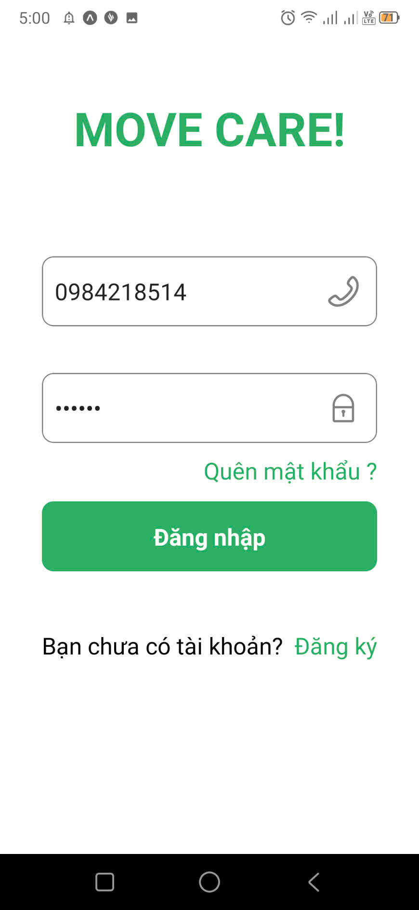
      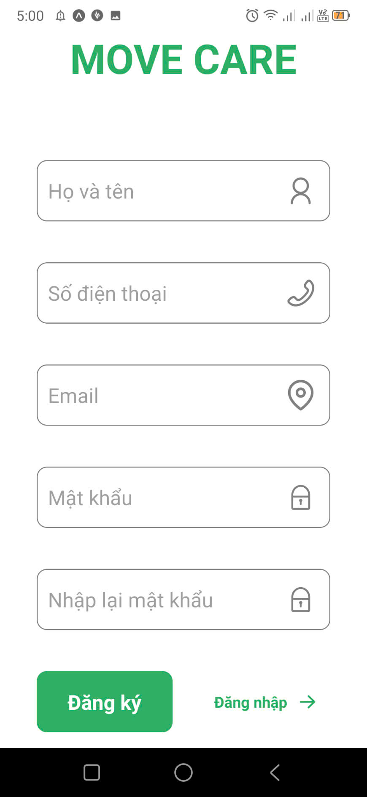
    

  - Employee  
  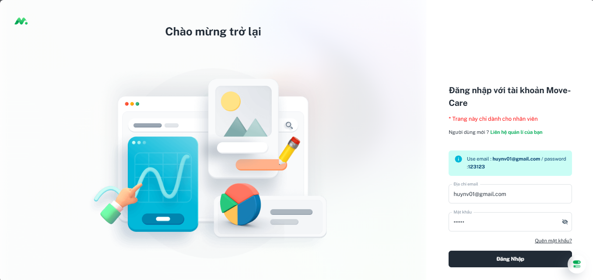
  - Manager
  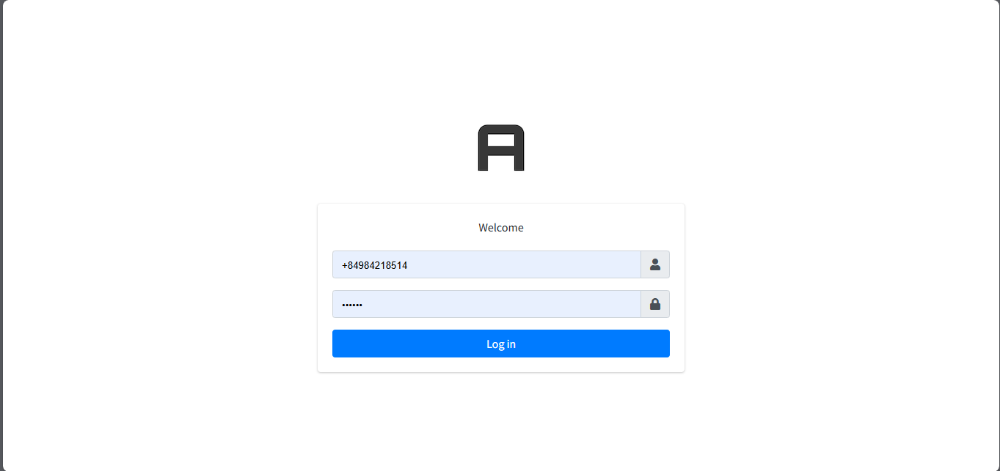  
- Customer (App) Interface:
  - Main/ Info/ Notification   
    

      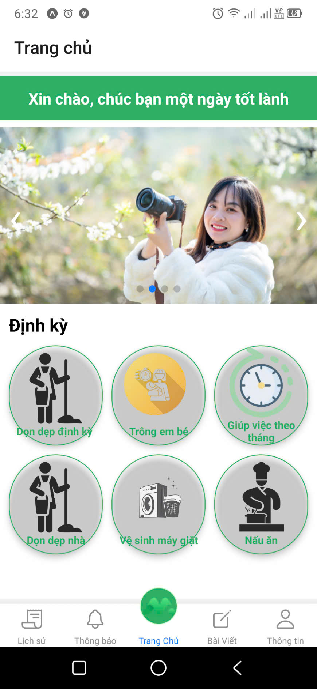
      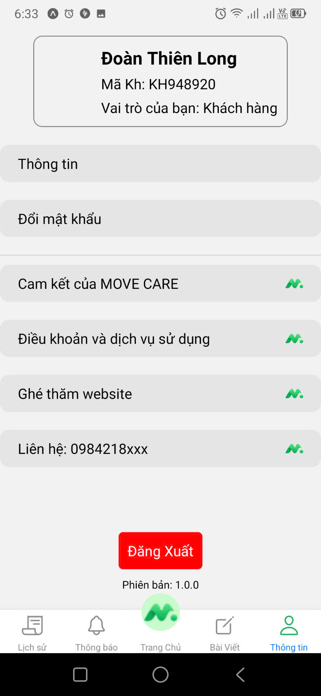
      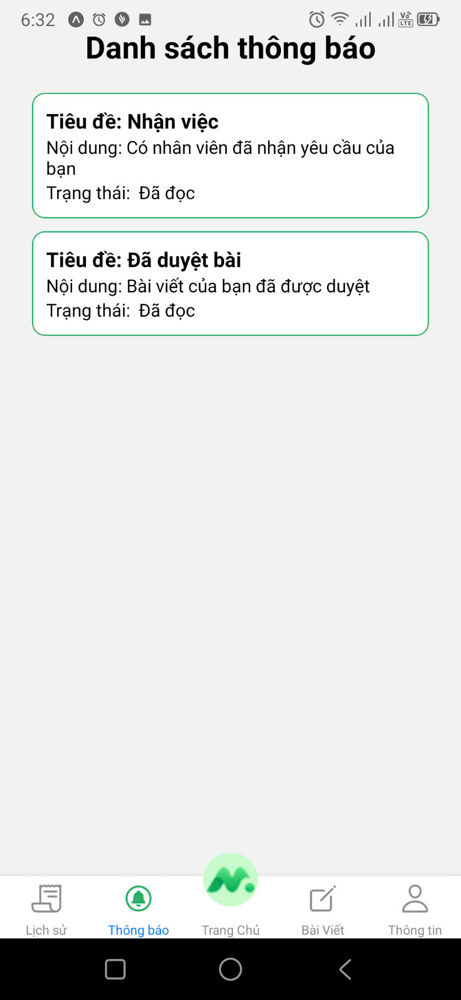
    

  - OTP/ Post/ ListPost
    

        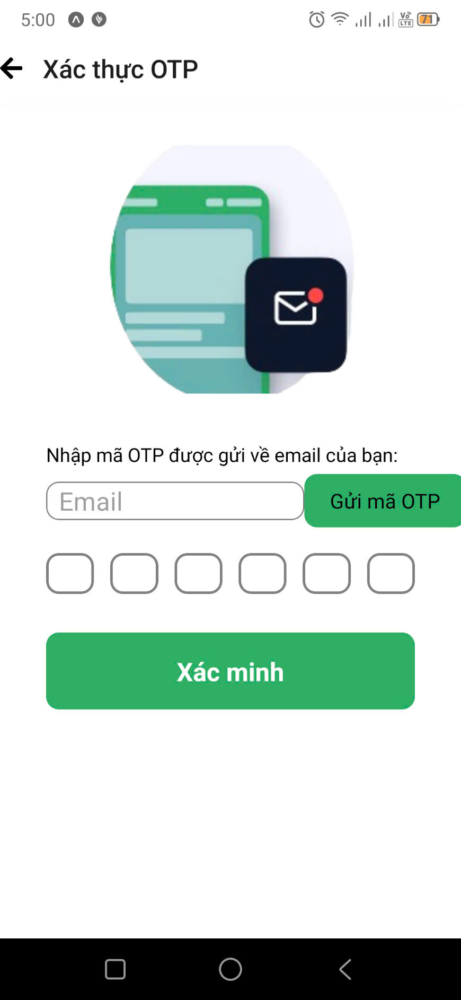
        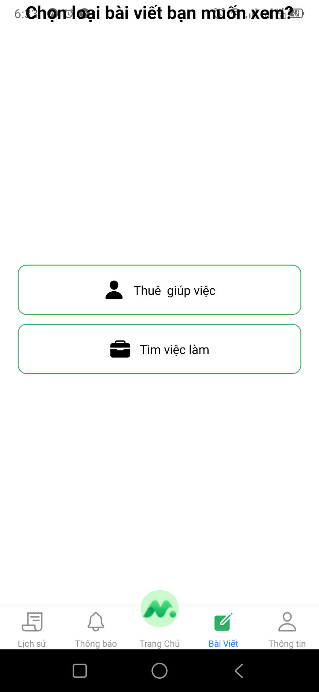
        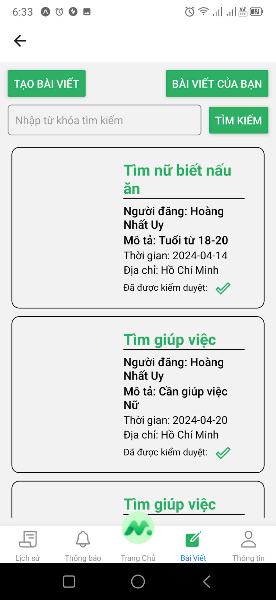
    

  - PostInfo
    

      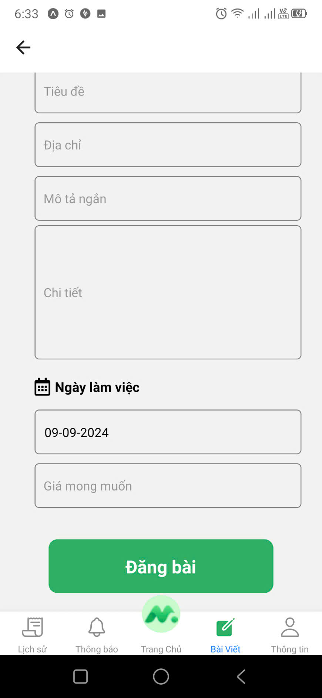
    
 
- Employee Interface:
  - Main
  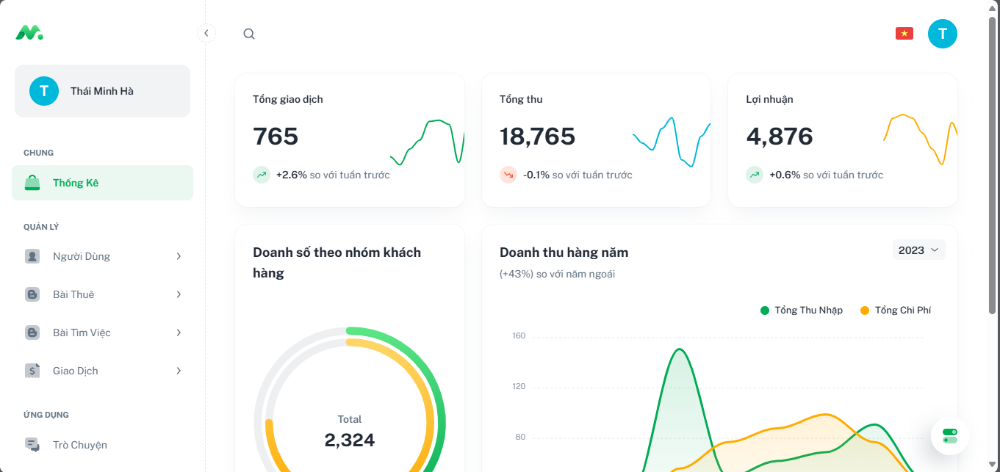
  - Access_Denid_post
  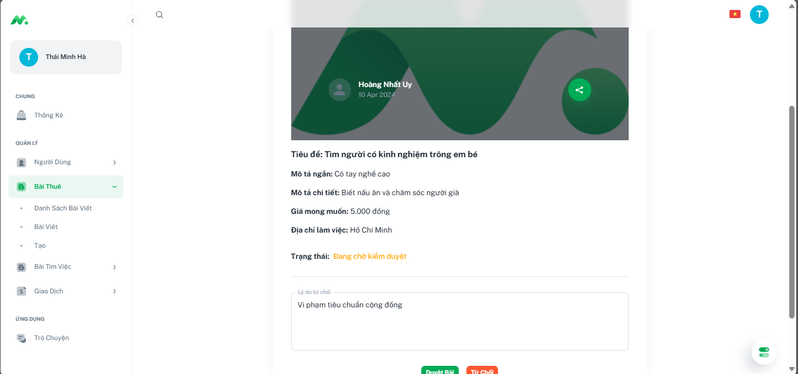
  - Customer_Manager
  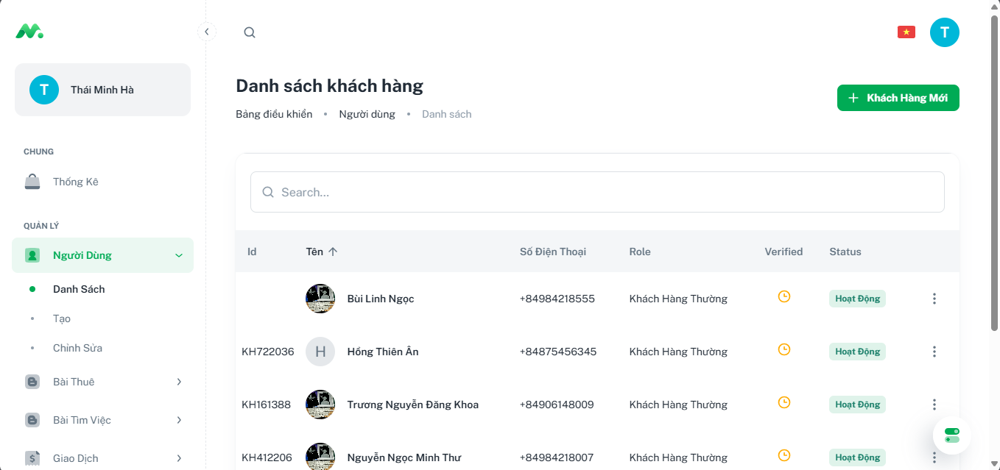
  - Post_Manager
  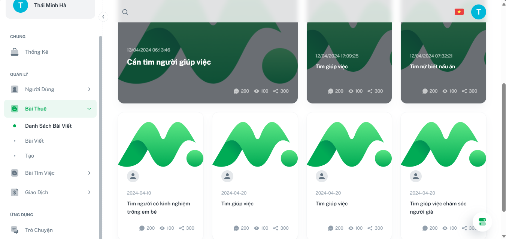
- Manager Interface
  - Main
  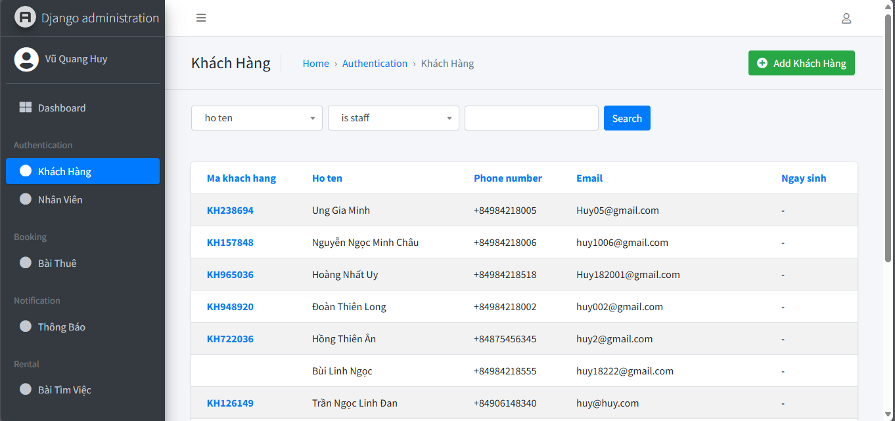
### VI. Demo
- Employee Page: [Employee Page](https://movecare.vercel.app/)
  -  Accounts: copy Email in  
  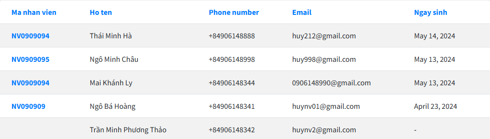
  - Password: `123123`
- Manager Page: [Manager Page](http://vuquanghuydev.pythonanywhere.com/admin/login/?next=/admin/)
  - Accounts: `+84984218514`
  - Password: `123123`
- Customer App: [Customer App]()
  - Accounts: copy Email in  
    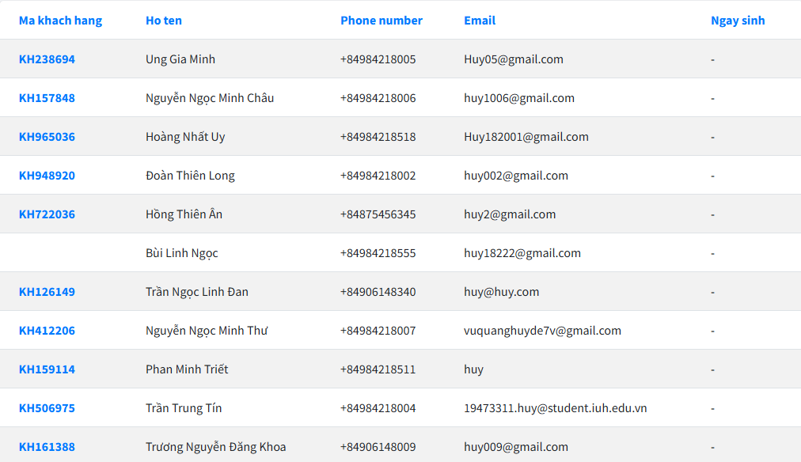
  - Password: `123123`
### VII. Documents
- Sorfwave Info: [Sorfwave Info](https://drive.google.com/file/d/1ABDB7YsD-YxcSSksCfRQnqkGjs_3_Klr/view?usp=sharing)
- Slide: [Slide](https://docs.google.com/presentation/d/1alUgbtRjxNYqOGTjrMdTnRfCKO_8lX6S/edit?usp=sharing&ouid=109527516488977417287&rtpof=true&sd=true)
- Poster: [Poster](https://drive.google.com/file/d/1o7YrZJ1PFZ1Vdrbg4upPE7ysd9GHGFLf/view?usp=sharing)
### VIII. Partner
- Vu Quang Huy

